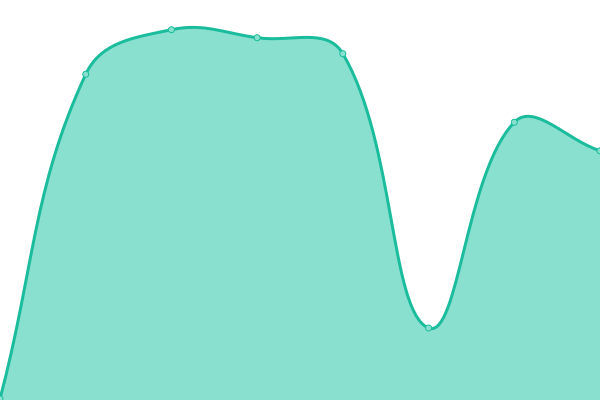

# [📈 Live Status](https://upptime.github.io/upptime): <!--live status--> **🟩 All systems operational**

<!--start: status pages-->
<!-- This summary is generated by Upptime (https://github.com/upptime/upptime) -->
<!-- Do not edit this manually, your changes will be overwritten -->
<!-- prettier-ignore -->
| URL | Status | History | Response Time | Uptime |
| --- | ------ | ------- | ------------- | ------ |
|  [Feedbin](https://feedbin.com/login) | 🟩 Up | [feedbin.yml](https://github.com/feedbin-homepage/uptime/commits/HEAD/history/feedbin.yml) | 

 273ms
     
 | 

<a href="https://feedbin-homepage.github.io/uptime/history/feedbin">100.00%</a>
    

<!--end: status pages-->

[**Status website →**](https://feedbin-homepage.github.io/uptime/)

Powered by [Upptime](https://github.com/upptime/upptime).
